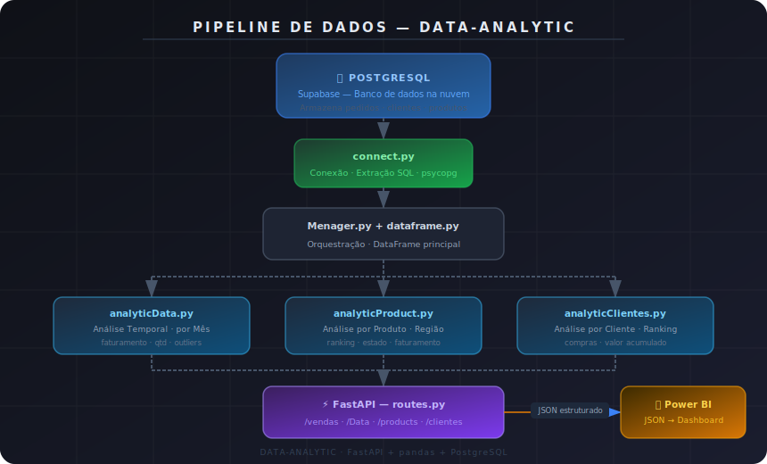
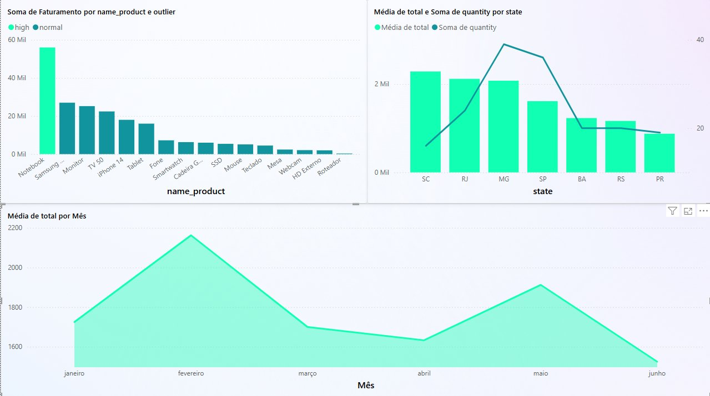

<div align="center">

# 📊 DATA-ANALYTIC

**Camada inteligente de análise de dados de vendas**

[](https://python.org)
[](https://fastapi.tiangolo.com)
[](https://supabase.com)
[](https://railway.app)
[](https://powerbi.microsoft.com)

*Uma API de dados que transforma dados brutos em inteligência analítica, pronta para consumo em ferramentas de BI.*

</div>

---

## 📌 Visão Geral

O **DATA-ANALYTIC** atua como uma camada intermediária entre o banco de dados e ferramentas de análise como o Power BI. Em vez de expor dados brutos, a API entrega **métricas calculadas**, **dados já tratados** e uma **estrutura padronizada** — centralizando toda a inteligência analítica em um único lugar.

---

## 🏗️ Arquitetura do Pipeline



O sistema segue um pipeline de dados estruturado em camadas:

| Camada | Arquivo | Responsabilidade |
|---|---|---|
| **Conexão** | `connect.py` | Conecta ao PostgreSQL via psycopg e extrai os dados |
| **Orquestração** | `Menager.py` + `dataframe.py` | Monta o DataFrame principal e distribui para os módulos |
| **Transformação** | `analytic*.py` | Aplica regras de negócio e análises com pandas |
| **API** | `routes.py` | Disponibiliza os dados via endpoints REST (FastAPI) |

---

## 📊 Análises Disponíveis

### 🗓️ Análise Temporal — `analyticData.py`

Consolida as vendas em uma visão mensal, identificando padrões ao longo do tempo.

| Métrica | Descrição |
|---|---|
| Mês | Período analisado |
| Quantidade vendida | Total de unidades no mês |
| Faturamento | Receita total do período |
| Classificação | Identificação de outliers estatísticos |

> Útil para detectar **sazonalidade**, **picos de desempenho** e **meses fora do padrão**.

---

### 📦 Análise por Produto — `analyticProduct.py`

Consolida o desempenho por item, incluindo distribuição geográfica de consumo.

| Métrica | Descrição |
|---|---|
| Produto | Nome do item |
| Total vendido | Quantidade acumulada |
| Faturamento | Receita gerada pelo produto |
| Estado | Região com maior volume de compra |
| Classificação | Outlier ou dentro do padrão |

> Útil para decisões de **estoque**, **marketing** e **priorização comercial**.

---

### 👤 Análise por Cliente — `analyticClientes.py`

Foca no comportamento de compra individual, gerando rankings de valor e recorrência.

| Métrica | Descrição |
|---|---|
| Cliente | Identificação |
| Compras realizadas | Frequência de pedidos |
| Faturamento total | Valor acumulado gerado |

> Útil para **segmentação**, **retenção** e identificação de **clientes mais valiosos**.

---

## 📂 Estrutura do Projeto

```
data-analytic/
│
├── connect.py            # Conexão com PostgreSQL (Supabase)
├── dataframe.py          # Carregamento do DataFrame principal
├── Menager.py            # Orquestração do pipeline
├── routes.py             # Endpoints FastAPI
│
├── analyticData.py       # Análise temporal (mensal)
├── analyticProduct.py    # Análise por produto
├── analyticClientes.py   # Análise por cliente
│
├── Alt2.py               # Módulo auxiliar reutilizável
│
└── /ANALYTIC/            # Persistência local em Excel
```

---

## ⚙️ Stack Tecnológica

| Tecnologia | Papel no projeto |
|---|---|
| **Python** | Linguagem principal — lógica, API e transformações |
| **FastAPI** | Framework HTTP — endpoints e documentação automática (`/docs`) |
| **pandas** | Motor analítico — groupby, agregações, métricas e datas |
| **PostgreSQL** | Banco de dados relacional — fonte dos dados de vendas |
| **Supabase** | Hospedagem cloud do PostgreSQL |
| **psycopg** | Driver de conexão Python → PostgreSQL |
| **Uvicorn** | Servidor ASGI para execução da aplicação |
| **Railway** | Plataforma de deploy com CI/CD via GitHub |
| **Power BI** | Consumo dos endpoints JSON para dashboards |

---

## 🚀 Como Executar Localmente

```bash
# Clone o repositório
git clone https://github.com/seu-usuario/data-analytic.git
cd data-analytic

# Instale as dependências
pip install -r requirements.txt

# Configure as variáveis de ambiente
cp .env.example .env
# Edite o .env com suas credenciais do Supabase

# Inicie a aplicação
uvicorn routes:app --reload
```

Acesse a documentação interativa em: `http://localhost:8000/docs`

---

## 🔌 Endpoints da API

Base URL (produção): `https://sua-api.railway.app`

---

### `GET /vendas`

Retorna o **DataFrame principal de pedidos** — dados brutos consolidados de todas as vendas.

```http
GET /vendas
```

**Resposta:**
```json
[
  {
    "client_id": 1,
    "name": "Nome do Cliente",
    "product": "Nome do Produto",
    "quantity": 10,
    "total": 500.00,
    "state": "SP",
    "created_at": "2024-03-15"
  }
]
```

---

### `GET /Data`

Retorna os dados **organizados por data (mensal)**, com faturamento, quantidade e classificação estatística de cada período.

```http
GET /Data
```

**Resposta:**
```json
[
  {
    "mes": "2024-01",
    "quantity": 320,
    "faturamento": 48500.00,
    "outlier": "normal"
  },
  {
    "mes": "2024-03",
    "quantity": 890,
    "faturamento": 134200.00,
    "outlier": "high"
  }
]
```

---

### `GET /products`

Retorna os dados **agrupados por produto**, com ranking de desempenho, faturamento e estado com maior volume de compra.

```http
GET /products
```

**Resposta:**
```json
[
  {
    "product": "Produto A",
    "quantity": 540,
    "faturamento": 81000.00,
    "max_state": "SP",
    "outlier": "normal"
  }
]
```

---

### `GET /clientes`

Retorna os dados **agrupados por cliente**, com quantidade de compras realizadas e faturamento total gerado por cada um.

```http
GET /clientes
```

**Resposta:**
```json
[
  {
    "name": "Nome do Cliente",
    "quantity": 14,
    "faturamento": 21000.00
  }
]
```

---

## 📊 Consumo no Power BI

1. Abra o **Power BI Desktop**
2. Selecione **Obter Dados → Web**
3. Insira a URL do endpoint desejado
4. Os dados chegam em JSON estruturado, prontos para modelagem e visualização

### Dashboard em produção

Abaixo um exemplo real do dashboard gerado a partir dos dados desta API:



O dashboard consome os quatro endpoints da API e apresenta três visões complementares:

 Faturamento por Produto *(canto superior esquerdo)*
Gráfico de barras gerado a partir do endpoint `/products`, exibindo a soma de faturamento por produto com classificação de outlier (`high` em verde claro · `normal` em verde escuro). O Notebook lidera com ~55 mil, destacando-se como outlier de alto desempenho.

 Média de Total e Quantidade por Estado *(canto superior direito)*
Gráfico combinado (barras + linha) alimentado pelo endpoint `/vendas`, cruzando ticket médio e volume de vendas por estado. SP se destaca com o maior volume de quantidade (~38 unidades), enquanto SC e RJ lideram em ticket médio.

 Média de Total por Mês *(inferior)*
Gráfico de área gerado a partir do endpoint `/Data`, mostrando a evolução mensal do ticket médio. Fevereiro apresenta o pico (~2.150), com queda em março-abril e recuperação em maio — padrão identificado pelo módulo de detecção de outliers.

---

<div align="center">

*Desenvolvido com foco em organização, reutilização e clareza arquitetural.*

</div>
